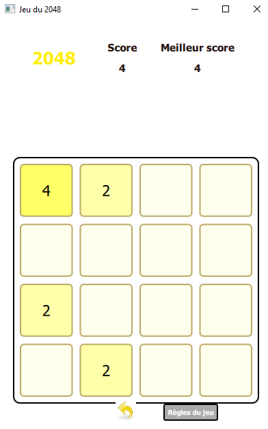
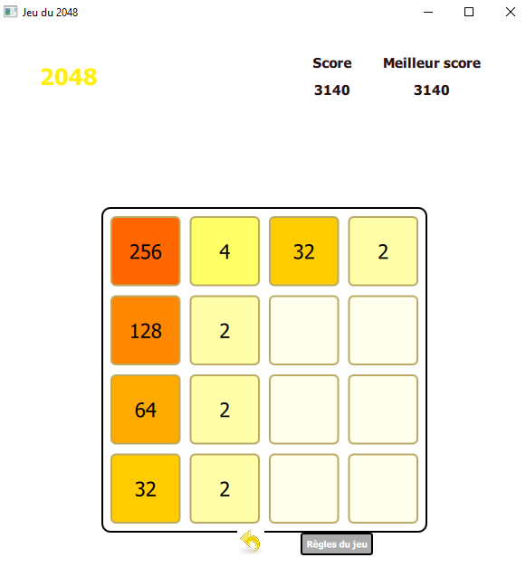
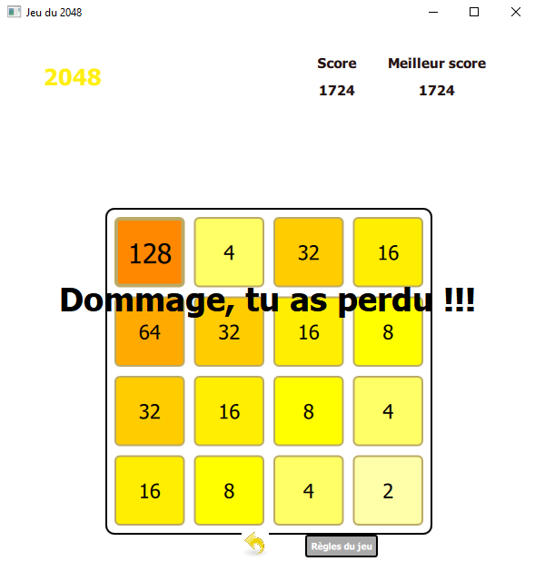
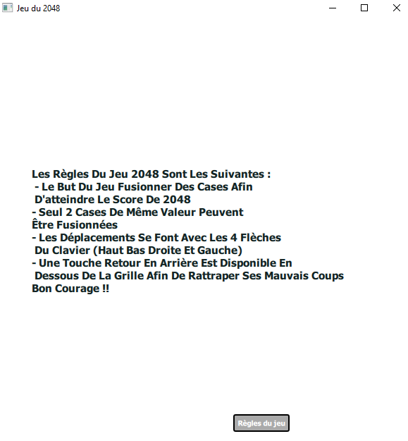

# 2048 Project

This project aims at developing the famous game 2048 with QtCreator and the C++ programming language. It has an educational goal, both the learning of the graphical interface programming with QtCreator and the learning of the programming language C++.

## Game rules

The game allows players to use the 4 directions of the keyboard to modify the values in the square and achieve victory, i-e a 2048-value square.
The score of the player is displaid and modified with the moves. The latter can use a go-back square (below the grid) to go back to the previous grid, before the last move, and to avoid defeat.
If the player needs to check the rules he can have a look at the rules at any time with the button "Règles du jeu".

## How to use the game ?

Before running the game, you must create a text file and fill in it with the value 0 (initialization of the best score), this file will keep in memory the best score. You must also modify the path to this file, it is contained in the variable adresse_meillleur_core of the jeu2048 class.   

----------------

# Projet 2048

Projet de développement du jeu 2048 sous QtCreator en langage C++. Ce projet, à but pédagogique, a eu pour objectif l'apprentissage de la programmation d'interfaces graphiques sous QtCreator ainsi que l'apprentissage du langage C++.

## Règles du jeu

Le jeu permet aux joueurs d'utiliser les 4 flèches de leur clavier afin de modifier les valeurs des cases et d'atteindre la victoire, c'est-à-dire une case valant 2048.
Le score du joueur est affiché et modifié en temps réel. Ce dernier peut utiliser la case de retour en arrière (en dessous de la grille) afin de revenir à la grille précédente et ainsi se sortir des situations périeuses.
Si le joueur a un doute sur les règles du jeu, un bouton permet de les afficher ou de les enlever.

## Comment utiliser le jeu ?

Avant de lancer le jeu, créez un fichier texte et remplissez le simplement avec la valeur 0 (initialisation du meilleur_score), c'est ce fichier qui servira à garder en mémoire votre meilleur_score. Pensez également à modifier le chemin vers ce fichier qui est contenu dans la variable privée adresse_meilleur_score de la classe jeu2048.

Auteurs du projet : Maxime Peter et Julien Verdun.
Dates de réalisation : mars-avril 2019

----------------

## Démonstration du jeu

Les images ci-desssous illustrent le jeu et donne une aperçu de ces possibilités.

